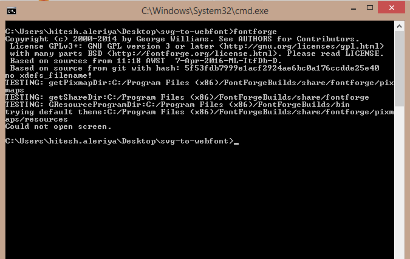

# Steps to convert svg to webfont (with ligature):

## First, you need to install following dependencies:
    1. node module:
       npm install grunt-webfont --save-dev (for converting svg to webfont)

       Note: If you are facing any issue in installing grunt-webfont, made following entry in package.json
      "grunt-webfont": "^0.5.3" and run cmd => npm install
    
    2. download and install fontforge
       https://sourceforge.net/projects/fontforgebuilds/

    3. After installing all the dependencies, now you need to add fontforge bin directory to windows PATH variable. 
       You can check whether you set correct path or not by running following cmd:
       
       fontforge
 On success, it will show like this:
       <p align="center">
           
       </p>

       On error, it will show like this:
       'fontforge' is not recognized as an internal or external command, operable program or batch file.
    
       Note: Close current cmd prompt and open a new cmd prompt for checking fontforge path.
    
## Create webfont task in Gruntfile.js:
   ```
   webfont: {
        icons: {
            src: 'svg/*.svg',          // svg src folder
            dest: 'fonts/',            // font destination folder
            options: {
            font:"NaukriIcons",    // Name of font and base name of font files.
            engine: "fontforge",   // Engine to use (Use 'fontforge' for ligatures support)
            ligatures: true        // ligatures boolean flag
            }
        }
    }
    ```

## Now you can convert svg to webfont by running following command:
    
    grunt webfont

You can find webfonts in destination folder (Open fonts/NaukriIcons.html file for demo).